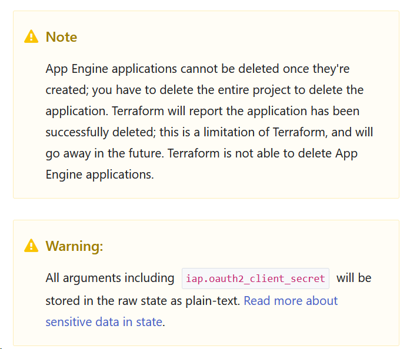

# Architecture Decision Record

# Decide the Running Platform for the Application

## Status

Proposed

## Context

There are many options for running  applications in the Google cloud. Some of the possible options are the following:
 - Compute instances behind a load balancer
 - Serverless in Google AppEngine
 - Serverless in Cloud Run
 - Serverless Cloud Functions
 - GKE

## Decision

The decision factor in this exercise is simplicity and the least code complexity. This is what was communicated as a requirement.
Based on that the best option is to run the application in cloud run. 

The rest are rejected because of the following reasons:
 - Compute instances behind a LB: High Terraform Code complexity, Higher cloud costs
 - Serverless in Google AppEngine: Higher Terraform code complexity. Limitations in terraform provider:

 - Serverless Cloud Functions: Not suitable for this application. 
 - GKE: Overkill for a simple containerized application. Higher terraform code complexity. Higher maintenance costs.

## Consequences

If more microservices need to be deployed in the future it might be better to switch to a GKE cluster. Simplicity is 
ensured.