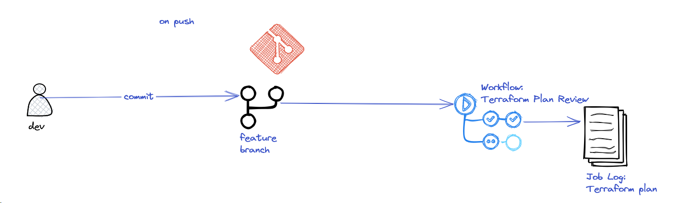
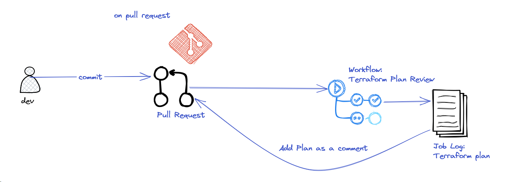
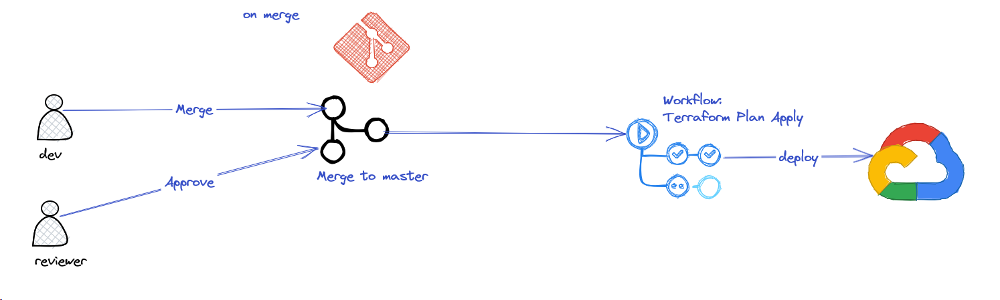
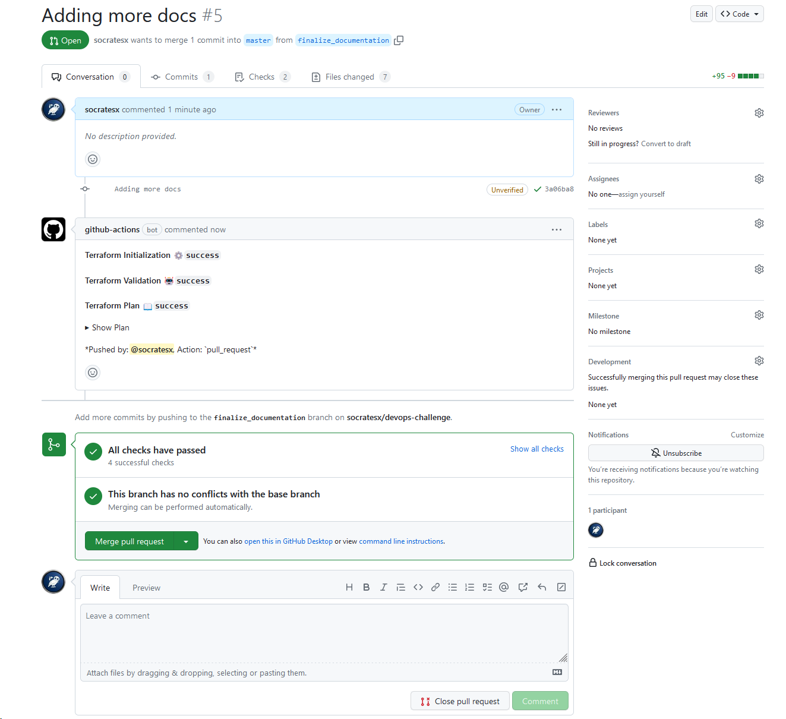
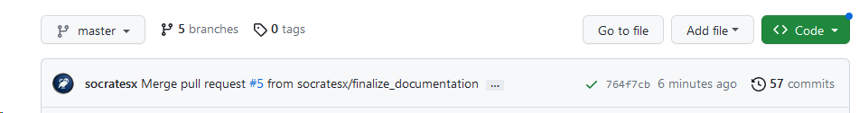

# CI/CD Workflow

The CI/CD of the project is implemented in github actions. The workflow files are located here: [.github/workflows](../.github/workflows)

The complete workflow can be summarized to the following steps:
1. A developer creates a feature branch to work on a new feature.
2. On every push the [terraform-plan-review.yml](../.github/workflows/terraform-plan-review.yml) workflow 
starts and always perform a plan for the dev to review. If any errors he would know before creating a PR. 
3. When the dev is finished with their changes he creates a PR. The same workflow is being run but an extra steps runs
this time that attaches the plan as a comment to the PR.
4. Another person can review and approve the PR. 
5. The dev merges the PR and the [terraform-plan-apply.yml](../.github/workflows/terraform-plan-apply.yml) 
runs this time that performs a terraform apply.

So we can distinct three cases.

## Pushes

The master branch is protected so no direct pushes are allowed. Pushes refer only to feature branches. The workflow can 
be summarized with the following diagram:



## Pull Requests

On pull requests the same workflow with pushes is triggered, but this time it attaches the plan as a comment for the
review process:



## Merges

When a branch is merged it means that has passed review process and the new application version can be deployed:



## Deploying a new version

With every workflow run the commit short sha is used as an application version. This variable is being passed to the 
terraform apply command: 

`terraform apply -auto-approve -var 'app_version=${{steps.short-sha.outputs.sha}}'`

This means that the terraform configuration will build a new container tag and push it to the artifact registry. Next it
updates the cloud run service with a new revision based on the new container tag. 

If the revision passes all health checks it receives 100% of traffic. If something is failed in the process, terraform 
apply step will fail indicating that there is a problem. In the cloud run the new revision will show up as problematic
with 0% traffic ensuring that production is not affected by this failure.

## Demo CI/CD

This section shows the above behavior: 

The application is deployed already with this MR: 
https://github.com/socratesx/devops-challenge/pull/4

We verify the revision that is running:

```shell
$ gcloud run services list
   SERVICE  REGION        URL                                   LAST DEPLOYED BY                               LAST DEPLOYED AT
✔  app1     europe-west3  https://app1-rnjuzlnrvq-ey.a.run.app  svc-terraform@esl-efg.iam.gserviceaccount.com  2023-05-04T17:35:40.429931Z

```

We are testing the application: 

```shell
$ curl -H "Authorization: Bearer $(gcloud auth print-identity-token)" https://app1-rnjuzlnrvq-ey.a.run.app/health
UP
```

1. We create a new feature branch: 
```shell
$ git checkout -b finalize_documentation
Switched to a new branch 'finalize_documentation'

```

2. We do our changes, commit and push the new branch:
```shell
$ git add .
$ git status
On branch finalize_documentation
Changes to be committed:
  (use "git restore --staged <file>..." to unstage)
        modified:   .github/workflows/terraform-plan-apply.yml
        modified:   .github/workflows/terraform-plan-review.yml
        new file:   docs/CI-CD-Workflow.md
        new file:   docs/CI-Workflow-on-Merge.png
        new file:   docs/CI-Workflow-on-PR.png
        new file:   docs/CI-Workflow-on-push.png
        modified:   readme.md

$ git commit -m "Adding more docs"
[finalize_documentation 3a06ba8] Adding more docs
 7 files changed, 95 insertions(+), 9 deletions(-)
 create mode 100644 docs/CI-CD-Workflow.md
 create mode 100644 docs/CI-Workflow-on-Merge.png
 create mode 100644 docs/CI-Workflow-on-PR.png
 create mode 100644 docs/CI-Workflow-on-push.png

$ git push --set-upstream origin finalize_documentation
Username for 'https://github.com': socratesx
Password for 'https://socratesx@github.com': 
Enumerating objects: 19, done.
Counting objects: 100% (19/19), done.
Delta compression using up to 8 threads
Compressing objects: 100% (11/11), done.
Writing objects: 100% (12/12), 214.73 KiB | 11.30 MiB/s, done.
Total 12 (delta 5), reused 0 (delta 0)
remote: Resolving deltas: 100% (5/5), completed with 5 local objects.
remote: 
remote: Create a pull request for 'finalize_documentation' on GitHub by visiting:
remote:      https://github.com/socratesx/devops-challenge/pull/new/finalize_documentation
remote: 
To https://github.com/socratesx/devops-challenge.git
 * [new branch]      finalize_documentation -> finalize_documentation
Branch 'finalize_documentation' set up to track remote branch 'finalize_documentation' from 'origin'.

```
4. We follow the workflow changes in github: https://github.com/socratesx/devops-challenge/actions/runs/4886164043
We observe in the produced plan: 

```shell
  # module.app1.google_cloud_run_v2_service.service will be updated in-place
  ~ resource "google_cloud_run_v2_service" "service" ***
        id                      = "projects/esl-efg/locations/europe-west3/services/app1"
        name                    = "app1"
        # (17 unchanged attributes hidden)

      ~ template ***
          ~ revision                         = "app1-3722dc" -> "app1-3a06ba"
            # (5 unchanged attributes hidden)

          ~ containers ***
              ~ image   = "europe-west3-docker.pkg.dev/esl-efg/db-health-checker/db-health-checker:3722dc" -> "europe-west3-docker.pkg.dev/esl-efg/db-health-checker/db-health-checker:3a06ba"
                # (2 unchanged attributes hidden)

                # (9 unchanged blocks hidden)
            ***

            # (2 unchanged blocks hidden)
        ***

        # (1 unchanged block hidden)
    ***

  # module.app_image.null_resource.image_push must be replaced
-/+ resource "null_resource" "image_push" ***
      ~ id       = "8777258287335098534" -> (known after apply)
      ~ triggers = *** # forces replacement
          ~ "always_run" = "2023-05-04T17:33:17Z" -> (known after apply)
        ***
    ***

Plan: 1 to add, 1 to change, 1 to destroy.
```
Which is exactly what we expect. It will run the `null_resource` to build & push a new container tag `3a06ba` and then to apply the 
new revision to the cloud run service.

We verify the tag locally:

```shell
$ git log 
commit 3a06ba8cdd3f5316dac28d78181b90c0c85edf4e (HEAD -> finalize_documentation, origin/finalize_documentation)
Author: Socrates Chouridis <socrates.chouridis@sportion.net>
Date:   Thu May 4 21:38:08 2023 +0300

    Adding more docs

```
5. We continue our development until we are finished and then we can do a Pull request:


We see the bot comment with the plan there.

6. We approve the PR and follow up the apply workflow


7. After job completes https://github.com/socratesx/devops-challenge/actions/runs/4886269015 

We check the commit sha:


And then we check the cloud run service:

```shell
$ gcloud run services describe app1 --region=europe-west3
✔ Service app1 in region europe-west3
 
URL:     https://app1-rnjuzlnrvq-ey.a.run.app
Ingress: all
Traffic:
  100% LATEST (currently app1-764f7c)
 
Last updated on 2023-05-04T18:54:54.321080Z by svc-terraform@esl-efg.iam.gserviceaccount.com:
  Revision app1-764f7c
  Image:             europe-west3-docker.pkg.dev/esl-efg/db-health-checker/db-health-checker:764f7c
  Port:              8080
  Memory:            512Mi
  CPU:               1000m
  Service account:   458217262457-compute@developer.gserviceaccount.com
  Env vars:
    POSTGRESQL_DBNAME postgres
    POSTGRESQL_HOST  10.96.0.2
    POSTGRESQL_PORT  5432
    POSTGRESQL_USER  postgres
  Secrets:
    POSTGRESQL_PASSWORD db_password:latest
  Concurrency:       80
  Min Instances:     2
  Max Instances:     4
  Timeout:           300s
  VPC connector:
    Name:            projects/esl-efg/locations/europe-west3/connectors/serverless-vpc-connector
    Egress:          all-traffic
  CPU Allocation:    CPU is only allocated during request processing
  Session Affinity:  false
  Startup Probe:
    TCP every 240s
    Port:            8080
    Initial delay:   0s
    Timeout:         240s
    Failure threshold: 1
  Liveness Probe:
    HTTP every 10s
    Path:            /health
    Initial delay:   20s
    Timeout:         1s
    Failure threshold: 3

```
We verify that image tag matches the commit sha.

Finally, we check the application status by checking the endpoint: 
```shell
$ curl -H "Authorization: Bearer $(gcloud auth print-identity-token)" https://app1-rnjuzlnrvq-ey.a.run.app/health
UP

```

