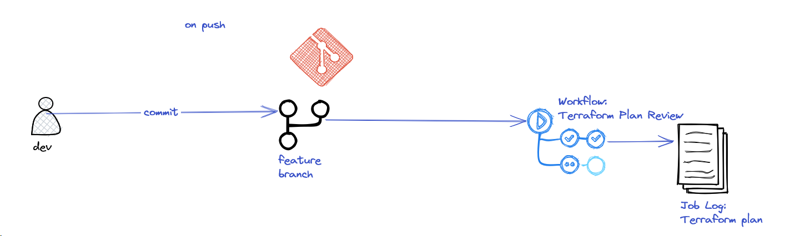
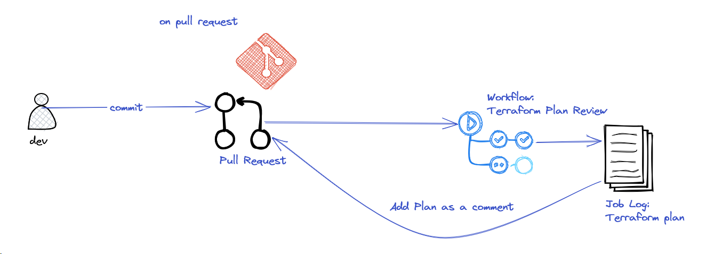
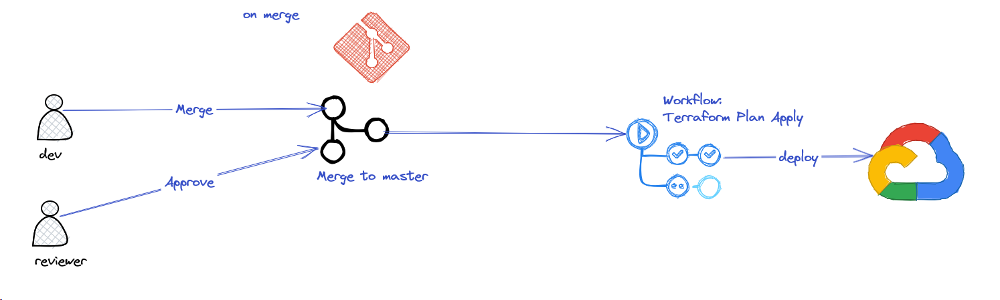

# CI/CD Workflow

The CI/CD of the project is implemented in github actions. The workflow files are located here: [.github/workflows](.github/workflows)

The complete workflow can be summarized to the following steps:
1. A developer creates a feature branch to work on a new feature.
2. On every push the [../.github/workflows/terraform-plan-review.yml](../.github/workflows/terraform-plan-review.yml) workflow 
starts and always perform a plan for the dev to review. If any errors he would know before creating a PR. 
3. When the dev is finished with their changes he creates a PR. The same workflow is being run but an extra steps runs
this time that attaches the plan as a comment to the PR.
4. Another person can review and approve the PR. 
5. The dev merges the PR and the [../.github/workflows/terraform-plan-apply.yml](../.github/workflows/terraform-plan-apply.yml) 
runs this time that performs a terraform apply.

So we can distinct three cases.

## Pushes

The master branch is protected so no direct pushes are allowed. Pushes refer only to feature branches. The workflow can 
be summarized with the following diagram:



## Pull Requests

On pull requests the same workflow with pushes is triggered, but this time it attaches the plan as a comment for the
review process:



## Merges

When a branch is merged it means that has passed review process and the new application version can be deployed:



## Deploying a new version

With every workflow run the commit short sha is used as an application version. This variable is being passed to the 
terraform apply command: 

`terraform apply -auto-approve -var 'app_version=${{steps.short-sha.outputs.sha}}'`

This means that the terraform configuration will build a new container tag and push it to the artifact registry. Next it
updates the cloud run service with a new revision based on the new container tag. 

If the revision passes all health checks it receives 100% of traffic. If something is failed in the process, terraform 
apply step will fail indicating that there is a problem. In the cloud run the new revision will show up as problematic
with 0% traffic ensuring that production is not affected by this failure.

## Demo CI/CD

This section shows the above behavior: 

The application is deployed already with this MR: 
https://github.com/socratesx/devops-challenge/pull/4

We verify the revision that is running:

```shell
$ gcloud run services list
   SERVICE  REGION        URL                                   LAST DEPLOYED BY                               LAST DEPLOYED AT
✔  app1     europe-west3  https://app1-rnjuzlnrvq-ey.a.run.app  svc-terraform@esl-efg.iam.gserviceaccount.com  2023-05-04T17:35:40.429931Z

```

We are testing the application: 

```shell
$ curl -H "Authorization: Bearer $(gcloud auth print-identity-token)" https://app1-rnjuzlnrvq-ey.a.run.app/health
UP
```

1. We create a new feature branch: 
```shell
$ git checkout -b finalize_documentation
Switched to a new branch 'finalize_documentation'

```

2. We do our changes and commit and push the new branch:
```shell

```