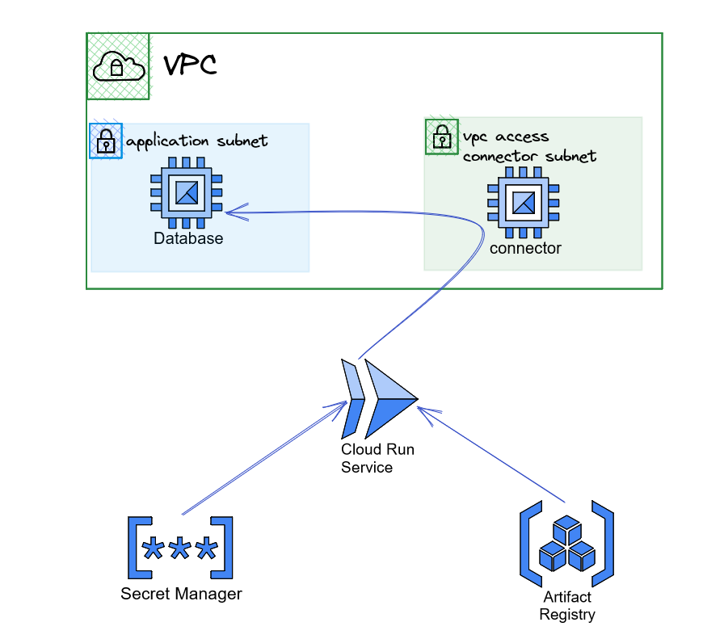

# FACEIT DevOps challenge solution

The proposed solution for this challenge can be summarized with the following High Level Diagram: 



The following components are deployed in that order: 

1. A VPC network with two subnets. One subnet for the database VM and one subnet for the serverless vpc connector. A VPC 
access connector is deployed to the VPC connector subnet.
2. A random password is created and stored in the secret manager.
3. An artifact registry is created, the application is being built and pushed to the artifact registry.
4. A container instance is created running a postgres DB, using the secret-data for the initial password. A firewall 
rule is allowing access to the compute instance DB port.
5. A cloud run service is deployed using the artifact in artifact registry and the secret-id to fetch the secret from 
secret manager and store it in postgres password env var.

The solution is based in custom & third-party Terraform modules. 

## Architectural Decisions

### Terraform Statefile Location
The ADR for the state files location is located in 
[./docs/ADR-terraform-state-file-location.md](./docs/ADR-terraform-state-file-location.md). The state file will be 
stored in a google bucket following the naming convention `{project_id}-statefiles`

### Application platform

The ADR for the platform is located in [./docs/ADR-application_platform.md](./docs/ADR-application_platform.md). 
The platform that was selected as the most suitable is Google Cloud Run.

### Container Registry

The ADR for this decision is located in  [./docs/ADR-container-registry.md](./docs/ADR-container-registry.md)

The Google Artifact Registry was selected for keeping the application artifacts. 

### Build Process

The ADR for this decision is located in  [./docs/ADR-build-process.md](./docs/ADR-build-process.md).

A custom inline script invoked by terraform was selected to keep things simple. 

## Project Structure

The project structure can be summarized in the following list:

 - `test-app/`: Untouched application code from original repository
 - `docs/` : Contains documents & diagrams
 - `scripts/`: Contains scripts & helpers
 - `terraform/`: Contains the proposed solution

## Requirements

### Google APIs
The google project needs to have the following apis enabled:

- compute.googleapis.com 
- cloudresourcemanager.googleapis.com 
- artifactregistry.googleapis.com 
- secretmanager.googleapis.com 
- run.googleapis.com 
- vpcaccess.googleapis.com 
- iamcredentials.googleapis.com

There is a script to do that in [scripts/enable_required_apis.sh](scripts/enable_required_apis.sh)

### Service Account Configuration for Terraform

A service account is required for terraform to run. The service account needs the following roles assigned:
 - roles/iam.serviceAccountTokenCreator
 - roles/compute.networkAdmin 
 - roles/storage.objectViewer 
 - roles/compute.instanceAdmin     
 - roles/compute.loadBalancerAdmin 
 - roles/compute.securityAdmin 
 - roles/artifactregistry.admin 
 - roles/iam.serviceAccountUser 
 - roles/secretmanager.admin 
 - roles/run.admin 
 - roles/vpcaccess.admin 
 - roles/servicemanagement.admin

#### Configure Terraform

The next step is to configure required variables: 

 - `project_id`
 - `region`
 - `bucket name`

The `project_id` & `region` can be set here [terraform/variables.tf](terraform/variables.tf) or during running.

The backend is using GCS to store the state files. Configure the bucket name in the following location:
[terraform/provider.tf](terraform/provider.tf)

Unfortunately backend configuration cannot use variables, so the bucket name must be configured manually.

To create a bucket you can use the following script:
[scripts/create_bucket_for_terraform_state.sh](scripts/create_bucket_for_terraform_state.sh)

```shell
Creating gs://esl-efg-statefiles/...
```
Use the name above to configure the backend.

## Getting Started

You can run this project locally or with github actions.

### Local Setup

To run locally the project, the PC must meet the following requirements: 
 - gcloud CLI 
 - docker 
 - terraform

If you already have a service account that you want to use for this project you can skip the next section.
Just export the following variable:

```shell
export GOOGLE_APPLICATION_CREDENTIALS=path/to/existing-service-account-key-file
```

#### Setup a new service account
The gcloud cli tool must be already configured with an IAM account that has at least IAM administrator permissions to run
the [scripts/create_terraform_service_account.sh](scripts/create_terraform_service_account.sh) script.

The [scripts/create_terraform_service_account.sh](scripts/create_terraform_service_account.sh) is setting up this service
account and creates the necessary key in the project root. It is created only for convenience and it is not required for
the solution. Just configure the correct `PROJECT_ID` the name for the service account:

```shell
PROJECT_ID=esl-efg
TERRAFORM_SERVICE_ACCOUNT_NAME=svc-terraform
```

_Warning: Pay attention to the `TERRAFORM_SERVICE_ACCOUNT_NAME`, if you add an existing account name there and run the script, it 
will remove existing keys from google platform for that account before creating a new key that it will use for running 
terraform. __DO NOT USE AN EXISTING ACCOUNT__._

It is recommended to create a new project for testing this solution out. 

To run the script do it from the __project root__: 

Example:

```shell
$ ./scripts/create_terraform_service_account.sh 
Setting the project_id to esl-efg
Updated property [core/project].
creating service account svc-terraform
adding IAM policy bindings to the svc-terraform service account
Updated IAM policy for project [esl-efg].
Updated IAM policy for project [esl-efg].
Updated IAM policy for project [esl-efg].
Updated IAM policy for project [esl-efg].
Updated IAM policy for project [esl-efg].
Updated IAM policy for project [esl-efg].
Updated IAM policy for project [esl-efg].
Updated IAM policy for project [esl-efg].
Updated IAM policy for project [esl-efg].
Updated IAM policy for project [esl-efg].
Updated IAM policy for project [esl-efg].
Updated IAM policy for project [esl-efg].
Updated IAM policy for project [esl-efg].
Deleting the following keys c1ea3019fcd02c0a227e3164fb0b79387aef91cf
85973262fac8197c0c3c3edfd60dfaaa5b74f005
ERROR: (gcloud.iam.service-accounts.keys.delete) INVALID_ARGUMENT: Service Account Key c1ea3019fcd02c0a227e3164fb0b79387aef91cf is a system managed key and can not be deleted.
deleted key [85973262fac8197c0c3c3edfd60dfaaa5b74f005] for service account [svc-terraform@esl-efg.iam.gserviceaccount.com]
Creating a new key for svc-terraform and storing it locally in /home/socratesx/Workspace/Pycharm/my-stuff/efg/terraform-service-account.json
created key [5f349cba3ed7adf30f4d4db14ca1a5814a9f96a6] of type [json] as [/home/socratesx/Workspace/Pycharm/my-stuff/efg/terraform-service-account.json] for [svc-terraform@esl-efg.iam.gserviceaccount.com]

```
The script creates a file in project root: `terraform-service-account.json` so you can use it for provider authentication:

```shell
export GOOGLE_APPLICATION_CREDENTIALS=$PWD/terraform-service-account.json
```

#### Initialize and run Terraform

To run the solution go to [terraform](terraform) and follow the steps:
1. Run `terraform init`: 
```shell
$ terraform init
Initializing modules...
- app1 in modules/cloudrun_service
- app_image in modules/container_registry
- application_network in modules/network
- database in modules/container_compute_instance
Downloading registry.terraform.io/terraform-google-modules/container-vm/google 2.0.0 for database.gce-container...
- database.gce-container in .terraform/modules/database.gce-container
- db_secret in modules/secret

Initializing the backend...

Successfully configured the backend "gcs"! Terraform will automatically
use this backend unless the backend configuration changes.


Initializing provider plugins...
- Finding latest version of hashicorp/null...
- Finding latest version of hashicorp/random...
- Finding hashicorp/google versions matching "4.63.0"...
- Finding kreuzwerker/docker versions matching "3.0.2"...
- Finding latest version of hashicorp/google-beta...
- Installing hashicorp/random v3.5.1...
- Installed hashicorp/random v3.5.1 (signed by HashiCorp)
- Installing hashicorp/google v4.63.0...
- Installed hashicorp/google v4.63.0 (signed by HashiCorp)
- Installing kreuzwerker/docker v3.0.2...
- Installed kreuzwerker/docker v3.0.2 (self-signed, key ID BD080C4571C6104C)
- Installing hashicorp/google-beta v4.63.1...
- Installed hashicorp/google-beta v4.63.1 (signed by HashiCorp)
- Installing hashicorp/null v3.2.1...
- Installed hashicorp/null v3.2.1 (signed by HashiCorp)

Partner and community providers are signed by their developers.
If you'd like to know more about provider signing, you can read about it here:
https://www.terraform.io/docs/cli/plugins/signing.html

Terraform has created a lock file .terraform.lock.hcl to record the provider
selections it made above. Include this file in your version control repository
so that Terraform can guarantee to make the same selections by default when
you run "terraform init" in the future.

Terraform has been successfully initialized!

You may now begin working with Terraform. Try running "terraform plan" to see
any changes that are required for your infrastructure. All Terraform commands
should now work.

If you ever set or change modules or backend configuration for Terraform,
rerun this command to reinitialize your working directory. If you forget, other
commands will detect it and remind you to do so if necessary.
```
2. Now that the terraform is initialized with a GCS  backend, run `terraform plan`. For keeping this readme clean, the
command output can be seen here: [docs/plan.txt](docs/plan.txt)
3. If the plan is ok, then run `terraform apply`. For keeping the readme clean the command's output is stored in here:
[docs/apply.txt](docs/apply.txt)
4. When `terraform apply` command is finished, and if everything went well, the following output will be printed in the end: 
```shell
Apply complete! Resources: 20 added, 0 changed, 0 destroyed.

Outputs:

app1 = "https://app1-rnjuzlnrvq-ey.a.run.app"
```

We can use this endpoint to check the application health:
```shell
$ curl -H "Authorization: Bearer $(gcloud auth print-identity-token)" https://app1-rnjuzlnrvq-ey.a.run.app/health
UP
```

### Running Terraform with Github Actions

### Running in CI/CD

Provided that terraform is configured, to run the project with github actions, just make sure that you add the secret 
`GOOGLE_CREDENTIALS`in the repository. 

This variable is used in the workflow files [.github/workflows/](.github/workflows/)

The workflows are quite basic and are triggered on push/pull requests. For more information about CI/CD check the relevant
document here [docs/CI-CD-Workflow.md](docs/CI-CD-Workflow.md)

### Verify Resources

Either from google console or gcloud cli we can verify what we have deployed:

1. Checking subnets

```shell
$ gcloud compute networks subnets list --regions=europe-west3
NAME            REGION        NETWORK  RANGE          STACK_TYPE  IPV6_ACCESS_TYPE  INTERNAL_IPV6_PREFIX  EXTERNAL_IPV6_PREFIX
app-subnet      europe-west3  net1     10.96.0.0/20   IPV4_ONLY
connect-subnet  europe-west3  net1     10.8.0.0/28    IPV4_ONLY
default         europe-west3  default  10.156.0.0/20  IPV4_ONLY
```

2. Checking instances

```shell
$ gcloud compute instances list 
NAME      ZONE            MACHINE_TYPE  PREEMPTIBLE  INTERNAL_IP  EXTERNAL_IP    STATUS
database  europe-west3-b  e2-micro                   10.96.0.2    35.246.180.45  RUNNING
```
3. Checking secrets
```shell
$ gcloud secrets list
NAME         CREATED              REPLICATION_POLICY  LOCATIONS
db_password  2023-05-03T11:40:07  automatic           -
```
4. Checking Artifacts
```shell
$ gcloud artifacts docker images list europe-west3-docker.pkg.dev/esl-efg/db-health-checker
Listing items under project esl-efg, location europe-west3, repository db-health-checker.

IMAGE                                                                    DIGEST                                                                   CREATE_TIME          UPDATE_TIME
europe-west3-docker.pkg.dev/esl-efg/db-health-checker/db-health-checker  sha256:2e033ebd8de6f5209f8f15d55c5854903af14a7cdee6b623e0f8d29c80a9388b  2023-05-03T14:40:27  2023-05-03T14:40:27
```
5. Checking Cloud run services
```shell
$ gcloud run services list
   SERVICE  REGION        URL                                   LAST DEPLOYED BY                               LAST DEPLOYED AT
✔  app1     europe-west3  https://app1-rnjuzlnrvq-ey.a.run.app  svc-terraform@esl-efg.iam.gserviceaccount.com  2023-05-03T11:42:22.085385Z
```
