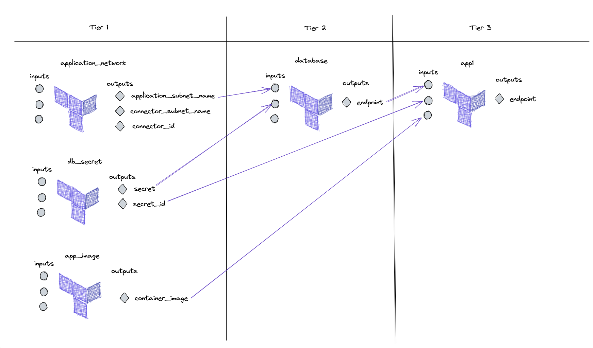

# Application Deployment

The [main.tf](main.tf) performs a series of module calls to deploy the necessary resources. The deployment is ordered.

The tiers can be summarized graphically with the following diagram:

